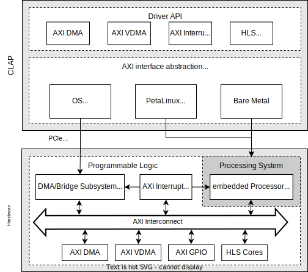

# CLAP

## Overview

CLAP is a C++ API aiming to simplify the usage of IP Cores in Xilinx FPGAs: 
- C++ 17, header-only
- Unified API to access IP Cores via PCIe (Xilinx XDMA), PetaLinux or Bare Metal
- Contains quickly learned interfaces to Xilinx DMA, VDMA, GPIO or user created HLS cores (AP_intf)
- It makes the time-consuming familiarization with Linux driver development superfluous. Write easy-to-debug code running in user-space without caring on low-level device access!





NOTE: This is work in progress. Current limitations:
- XDMA: Only Linux is supported
- Bare Metal is under development


## Requirements

	CMake >= 3.10.0
	g++ >= 9 or comparable compiler supporting C++17


### XDMA Driver [optional]
<details>
<summary> Detailed description </summary>

You only need this, if you are using a PCIe attached FPGA board.

Either use the latest version from the [official git](https://github.com/Xilinx/dma_ip_drivers) or the version (v2020.2.0) included here.

#### Using the official git:

**Checkout and build**

```bash
git clone https://github.com/Xilinx/dma_ip_drivers
cd dma_ip_drivers/XDMA/linux-kernel/xdma
make
sudo make install
```

**Test load the driver**

```bash
cd ../tests
sudo ./load_driver.sh
```

#### Using the included driver:

**Build**

```bash
cd driver/xdma
make
sudo make install
```

**Test load the driver**

```bash
cd ..
sudo ./load_driver.sh
```

#### Additional settings for both:

**Allow users to access the XDMA devices**

```bash
echo "SUBSYSTEM==\"xdma\", GROUP=\"users\", MODE=\"0666\"" | sudo tee /etc/udev/rules.d/60-xdma.rules
sudo udevadm trigger
```

**Check permissions**

The following command should output several xdma0_xxxx devices, e.g., xdma0_c2h_0 and xdma0_h2c_0, the number of devices and which are available depends on the configuration of the XDMA endpoint. If no devices are displayed make sure the FPGA is plugged in and has been programmed.

```bash
ls -la /dev/xdma*
```

**Automatically load the driver on boot**

```bash
echo "xdma" | sudo tee /etc/modules
echo "options xdma poll_mode=1" | sudo tee /etc/modprobe.d/xdma_options.conf 
```

</details>

## API Installation / Usage
<details>
<summary> Detailed description </summary>

For a fully working example please refer to the examples provided in the samples folder.

### Include the API into a project

Clone the git into your project or add it as a submodule

	git clone https://github.com/fporrmann/CLAP.git

When using CMake simply add CLAP as follows:

```cmake
# Find CLAP and initialize its variables
find_package(CLAP PATHS CLAP/API/cmake/modules REQUIRED)

# Add CLAP to the include directories
include_directories(${CLAP_INCLUDE_DIRS})

# Link against the libraries required by the CLAP
target_link_libraries (<YOUR_PROJECT_NAME> PRIVATE ${CLAP_LIBS})
```

When not using CMake, add CLAP/API/include to the include search path of your environment and link against pthread (or which ever threading library is used by your compiler in combination with std::thread).

### Use the API

At the moment please refer to the [DDRAccess example](samples/XDMA/DDRAccess/src/main.cpp).

</details>


## PetaLinux (WiP)
<details>
<summary> Detailed description </summary>

### Add the UIO driver to the kernel

1. Open the kernel configuration
```bash
petalinux-config -c kernel
```
2. Enable the UIO driver
```bash
Device Drivers -> Userspace I/O drivers -> Userspace platform driver with generic irq and dynamic memory
```
3. Save the configuration and exit
4. Open the PetaLinux configuration
```bash
petalinux-config
```
5. Modify the boot arguments to include the UIO driver
```bash
DTG-settings -> Kernel bootargs -> Add extra boot args
```
6. Add the following
```bash
uio_pdrv_genirq.of_id=generic-uio
```
6. Save the configuration and exit
7. Build PetaLinux, using `petalinux-build`

### Split of some memory from the kernel to use as exclusive memory for the FPGA design 

You need this, if you want to use DMA transfers

1. Open the device tree overlay
```bash
nano project-spec/meta-user/recipes-bsp/device-tree/files/system-user.dtsi 
```
2. Add the following after `/ {` and before `};`
```c
    // Restrict the memory available to the kernel to the first 512MB
    memory {
        device_type = "memory";
        reg = <0x00000000 0x20000000>;
    };

    // Create a new memory region (shm) for the FPGA design, starting at address 0x20000000 with a size of 512MB.
    // The name of the region is shm0 and it can be accessed using the UIO driver.
    shm: shm0@20000000 {
        compatible = "generic-uio";
        reg = <0x20000000 0x20000000>;
    };
```
3. Build PetaLinux, e.g., using `petalinux-build` or if the project has already been build and only changes to the device tree have been made using `petalinux-build -c kernel`

### Setup IP core in the device tree to use the UIO driver

1. Find the IP cores object name in the device tree, the object name usually is the same as the unique name of the IP block in Vivado. An `AXI DMA` core for example by default is called `axi_dma_ID`, where `ID` is the instance id of the block, starting at zero. In the device tree the start of the `AXI DMA` object would look similar to this `axi_dma_0: dma@40010000 {`, with `axi_dma_0` being the object name and `dma@40010000` being the name and address.
```bash
cat components/plnx_workspace/device-tree/device-tree/pl.dtsi
```
2. Open the user overlay dtsi file:
```bash
nano project-spec/meta-user/recipes-bsp/device-tree/files/system-user.dtsi 
```
3. After `};` add the following (replace <OBJ_NAME> with the object name from step 1, e.g., `axi_dma_0`):
```c
&<OBJ_NAME> {
    compatible = "generic-uio";
};
```
4. Build PetaLinux, e.g., using `petalinux-build` or if the project has already been build and only changes to the device tree have been made using `petalinux-build -c kernel`
5. After booting the new kernel a UIO device should be listed under `/dev/` with the name `uioX`, where `X` is the number of the device, starting at zero.

### Using an IP core with multiple interrupt lines in combination with the UIO driver

By default the UIO driver only supports a single interrupt line. To use an IP core with multiple interrupt lines either the driver needs to be modified or the IP core needs to be interconnected with an `AXI Interrupt Controller`. The latter is the easier approach and is described here.

1. In the Vivado block design add an `AXI Interrupt Controller` to the design
2. Connect the `clk` and `reset` signales of the `AXI Interrupt Controller` to the `clk` and `reset` signales of the IP core
3. Change the `Interrupt Output Connection` of the `AXI Interrupt Controller` to `Single`
4. Add a `Concat` IP core to the design
5. Set the `Number of Ports` of the `Concat` IP core to the number of interrupt lines of the IP core
6. Connect the interrupt lines of the IP core to the input ports of the `Concat` IP core
7. Connect the output port of the `Concat` IP core to the `Interrupt Request (intr)` port of the `AXI Interrupt Controller`
8. Connect the `Interrupt (irq)` port of the `AXI Interrupt Controller` to the `IRQ_F2P` port of the PS

Next, generate an new bitstream, export the hardware and update the hardware description of the PetaLinux project using:

```bash
petalinux-config --get-hw-description=<PATH_TO_VIVADO_PROJECT>
```

Afterward, the device tree needs to be updated to reflect the changes made to the hardware description, it is especially important to configure the `AXI Interrupt Controller` to use the UIO driver. This can be done by following the steps described in the section [Setup IP core in the device tree to use the UIO driver](#setup-ip-core-in-the-device-tree-to-use-the-uio-driver).

For an example of how to use an `AXI DMA` together with an `AXI Interrupt Controller` please refer to the [PetaLinux AxiDMA Example](samples/PetaLinux/AxiDMA/src/main.cpp).

### Modifications required when trying to use UIO together with an IP core whose interrupt line is connected to an AXI Interrupt Controller

In setups where an `AXI Interrupt Controller` acts as an intermediary between the IP core and the PS by default no UIO device will be created for the IP core. It is currently not entirely clear why this happens, but by removing the `interrupt-parent` property from the device tree object of the IP core this problem can be circumvented.

1. Open the device tree overlay
```bash
nano project-spec/meta-user/recipes-bsp/device-tree/files/system-user.dtsi 
```
2. Change the override for the IP core to the following (replace <OBJ_NAME> with the name of the object, e.g., `axi_dma_0`):
```c
&<OBJ_NAME> {
    compatible = "generic-uio";
    /delete-property/ interrupt-parent;
};
```
4. Build PetaLinux, e.g., using `petalinux-build` or if the project has already been build and only changes to the device tree have been made using `petalinux-build -c kernel`

### Allow users to access the UIO devices

```bash
echo "SUBSYSTEM==\"uio\", GROUP=\"users\", MODE=\"0666\"" | sudo tee /etc/udev/rules.d/uio.rules
sudo udevadm trigger
```
</details>
